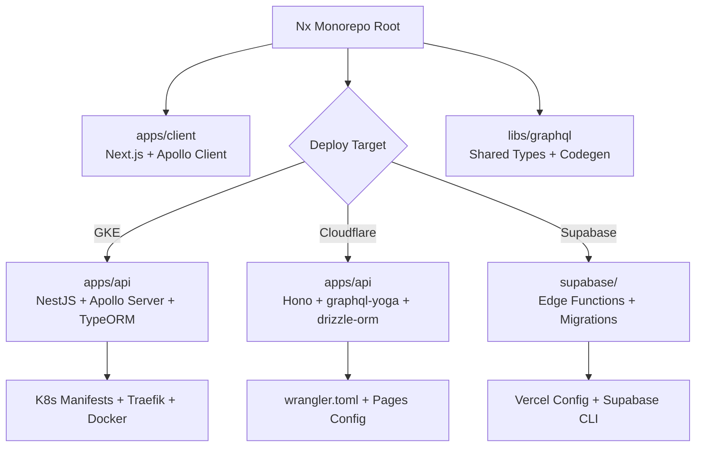

# Boilerplate Plugin

Full-stack project bootstrapper for Claude Code. Generates an Nx monorepo with Next.js + GraphQL and a deployment-specific API layer.

## Installation

```
/plugin install boilerplate@rytass-claude-code
```

## Supported Deployment Targets

| Aspect           | GKE (NestJS)                        | Cloudflare Workers + Pages           | Supabase                             |
|------------------|-------------------------------------|--------------------------------------|--------------------------------------|
| API Framework    | NestJS + Apollo Server              | Hono + graphql-yoga                  | Edge Functions (Deno)                |
| ORM / DB Client  | TypeORM                             | drizzle-orm                          | supabase-js                          |
| GraphQL          | Code-first                          | Schema-first                         | Schema-first                         |
| Database         | PostgreSQL (self-managed/Cloud SQL) | PostgreSQL (Neon)                    | Supabase PostgreSQL (managed)        |
| Frontend Deploy  | GKE Pod (same Pod)                  | Cloudflare Pages                     | Vercel                               |
| API Deploy       | GKE Pod (Docker)                    | Cloudflare Workers                   | Supabase Edge Functions              |
| Best For         | Enterprise, full control            | Edge computing, low latency          | Rapid prototyping, fully managed     |

## Usage

```
/init-project
/init-project my-app
/init-project --target=gke
/init-project my-app --target=cloudflare
/init-project --target=supabase my-saas
```

The `/init-project` command guides you through:

1. **Project name** — directory name and `@{name}` package scope
2. **Description** — one-line project purpose
3. **Deployment target** — GKE, Cloudflare, or Supabase (with comparison table)
4. **Confirmation** — review summary before generation
5. **Generation** — the `project-bootstrapper` agent creates all files

## Generated Project Structure



## Shared Tech Stack

All targets share:

- **Monorepo**: Nx + pnpm workspaces
- **Frontend**: Next.js (App Router) + Apollo Client
- **Language**: TypeScript (strict mode)
- **GraphQL**: Code generation for type-safe operations
- **Toolchain**: ESLint flat config, Prettier, commitlint, Husky + lint-staged
